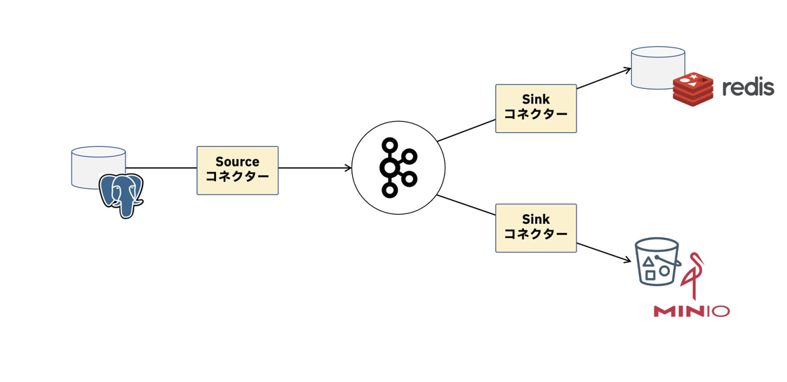

## Kafka とは

- ストリームデータの扱いに長けてる。
  - ストリームデータとは時間とともに次々と発生する無限量のデータ。
- ストリームデータを高スループットかつ低レイテンシでリアルタイムに処理する。

## Kafka の機能、役割

- メッセージング・バス
  - システム間でやりとりするデータ（イベント）を中継する
  - イベントが Kafka を中継することでイベントを送受信するシステム同士は互いの物理的な位置や処理タイミングを知る必要がない。この特徴により、Kafka を中継するシステム同士を疎結合に保てる
  - 送受信形態は Publish/Subscribe 型。送信側と受信側のシステムが 1 対多の関係
- ストレージ
  - Kafka に送信されたイベントはログファイルに追記することで永続化される
  - ログファイルは Kafka が稼働するサーバー(Broker)のファイルシステムに書き込まれまれる
  - アプリケーションが Kafka からイベントを受信してもログファイルにイベントが残るため、何度でもイベントを再生することが可能
  - Kafka はイベントだけでなく、受信側のシステムのイベント読み出し位置(Offset)も永続化する。読み出し位置を永続化することでイベントを受信するシステムは障害発生時も処理を途中から再開できるため、耐障害性の高いシステムとなる
  - イベントの永続方法はログファイルの末尾への追記となるため、データベースのように直接イベントを更新または削除できない。イベントを更新・削除する場合は、送信側のシステムから更新・削除イベントを Kafka に送信して、受信側で別途処理する必要がある
- ストリーム処理エンジン
  - ストリーム処理のバックエンドに Kafka を採用できる

## Kafka が作られた目的

- データの生成(送信)するシステムと、データを消費(受信)するシステムを分離する
- 同じデータを複数のシステムで消費できるようにするためデータを永続化する
- データを高スループットのために最適化する
- データストリームの成長に合わせて、システムを水平にスケールできる

## ユースケース

- メッセージブローカー
  - システム間連携のデータハブ
  - 受信側の高負荷を抑える処理バッファ
- アナリティクス
  - ユーザーアクティビティの追跡
  - データウェアハウスのためのデータパイプライン
- 運用管理
  - ログの集約・フォワーディング
  - メトリクスの収集
- データ共有
  - バックエンドシステムのデータを要件に応じて別システムのデータストアに複製
  - 複数ドメイン間のデータ共有
- マイクロサービス
  - イベントソーシングや CQRS のためのイベントストア
  - サービス間連携のオーケストレーション(saga パターン)
  - モノリスからサービスを分割するためのデータ移行レイヤー(strangler パターン)

## イベント

- イベントは kafka のメッセージ、レコードと同義
- イベント内には 4 つのデータがある
  - header
    - イベントのメタデータや補足情報を格納する
  - key
    - イベント格納先の振り分けや集約に使用されるデータ。
    - キーを設定しないことも可能
  - timestamp
    - イベントが作成された時刻。
  - value
    - イベントで処理したいデータ本体
    - 文字列、数値、JSON といった様々な形式のデータを値に指定可能

## Topic と Partition

- Partition は kafka クライアントアプリケーションから送信されたイベントを保持する
  - クライアントアプリケーションは Partition ごとにイベントを処理するため、Partition 数を増やすことでシステム全体のスループットを高められる
- イベントのキーを元に特定の Partition に割り振られて保存される
- 例えば、キーの 1 文字目が”a”から”j”は Partition0 に、”k”から”t”は Partition1 といった割り当てがされる
- Partition に保存されたイベントには Partition 内で連続した番号が割り振られる。この番号を Offset という
  - 同一の Partition はイベントの順序が送信順であることが保証される
    - ※ただし topic 内の Partition 間では順序は保証されない
  - 同一キーのイベントは同一の Partition に割り振られる。
- レプリケーションによる冗長化

  - 各 Partition のイベントは Kafka が動作する複数のサーバ(Broker)にコピーされる
  - 一つの Partition につき、レプリカ内で書き込み可能な Partition をリーダーと呼び、それ以外のコピーはフォロワーと呼ぶ。
  - リーダーレプリカの Broker に障害が発生した場合、別の Broker にいるフォロワーの Partition がリーダーに昇格することで処理を続行させる

  ## Producer と Consumer

  - Consumer

    - イベント呼び出し後、Partition ごとの処理済み Offset を記録するコミットを行う
    - Offset をコミットしておくことで、何らかの理由で Consumer が停止した場合も次の起動時に以前のコミット済み Offset から Partition 内のイベントを読み直せる
    - ただし Offset のコミット前に Consumer が停止すると、最新のコミットから停止直前まで読み取った Offset のイベントを 2 回読み取ることになるため、2 回以上イベントを読みとっても問題にならないよう Consumer の処理を冪等にしておく
    - 1 つ以上の Consumer をグルーピングした ConsumerGroup を構成することで、Topic から受信するイベントを負荷分散可能

      - ConsumerGroup 内で 1 つの Partition につき 1 つの Consume しかイベントを呼び出せないため、ConsumerGroup 内で負荷分散可能な Consume は最大 Partition 数まで

    - ConsumerGroup の Consumer の数が増減した場合、Consumer への Partition の際割り当て(リバランス)が自動的に行われる

  ## Broker と Zookeeper

  - Broker は kafka がインストールされ、プロセスが稼働するサーバー
    - Producer と Consumer がイベントを送受信する物理的な宛先は Broker
    - Broker でクラスタを組むことで冗長化できる
    - Partition を複製するレプリカ数の最大値は Broker の数と等しくなる
  - Zookeeper
    - 以下の情報を保持している
      - Topic の一覧
      - Topic の設定値
      - Partition の状態
      - Broker の一覧
      - Broker の ACL(Access Control List)の設定値
  - kafka を動作するために Zookeeper は必須だったが、kafka2.8 以降 Kafka クラスタを起動するモードが使用可能となった。このモードは Zookeeper に保存されていたメタデータを全て Broker で管理できるようになった

## kafka トランザクション

- kafka のイベントの配信品質は 3 つある
  - 最低 1 回の配信(At Least Once)
    - kafka のデフォルト
  - 最大 1 回の配信(At Most Once)
  - 正確に 1 回の配信(Exactly Once)
- At Least Once はイベントの重複を引き起こす
  - Producer でイベントを重複送信
    - 業務ロジックエラーからの復旧により、複数回同じイベントを送信した
    - アプリケーションのクラッシュ後に処理を再実行した
    - イベント送信が実際には完了しているにも関わらず、通信断などの影響でリトライされた
  - Consumer でイベントを重複受信
    - Producer でイベントが重複して送信された
    - Producer からイベントを送信されたが、エラー等の理由でビジネスロジックの処理がキャンセルされた
- At Least Once のイベント配信品質で発生するデータ不整合を防ぐにはトランザクション有効
  - Producer
    - トランザクション内のイベントは処理に成功した場合は全て有効なイベントとして Topic に書き込む
    - トランザクション内のイベントは処理に失敗した場合も Topic に書き込むが無効化される
    - 同一とみなされる Producer から送信済みのイベントはリトライ後も Topic/Partition に重複して書き込みされない
  - Consumer
    - トランザクションが成功したイベントのみ処理対象とする
    - イベントがすでに処理済みであれば Offset がコミットされるため、重複して読み取り、しょりすることはない
- トランザクションの仕組み

  - Producer と Consumer は内部で Transaction Coordinator とトランザクションログともやりとりしている
    - Transaction Coordinator はトランザクションの実行状況を管理する Kafka Broker 内のプリセス。
    - トランザクションログはトランザクションの実行状況を保持する特別な Topic。通常は\_\_tranzaction_state という名前の Topic になる。Transaction Coordinator はトランザクションログにトランザクション状況のイベントを書き込む

- トランザクションが有効な Producer の設定値
  - acks
    - “all” リーダーレプリカを含めて指定数の全てのレプリカにイベントを書き込みできたら完了とみなす
  - enable.idempotence
    - “true” Exactly Once の配信品質を有効化する
  - max.in.flight.requests.per.connection
    - “5 以下” 1 つのコネクションでイベントを送信待ち可能リクエスト数の最大値
  - retries
    - “0 より大きい数値” リトライは有効化する
  - transactional.id
    - “null 以外の文字列” トランザクションを実行する Producer を識別する ID
- トランザクションが有効な Consumer の設定値
  - isolation.level
    - “read_committed” イベント受信の分離レベル
- トランザクションを使用するための Kafka クラスタの設定注意
  - Producer はトランザクションログの冗長性を確保するため、Topic \_\_tranzaction_state は設定値 transaction.state.log.replication.factor のデフォルト値が 3 に設定されているため 3 つ以上の Broker が必要

## Practise

```bash
$ docker compose up -d
$ docker compose exec cli bash

# コンテナ内
$ kafka-topics --bootstrap-server broker:9092 --create --topic ird-first-topic --partitions 3 --replication-factor 1
$ kafka-topics --bootstrap-server broker:9092 --list ird-first-topic
$ kafka-topics --bootstrap-server broker:9092 --describe --topic ird-first-topic
$ kafka-console-producer --bootstrap-server broker:9092 --topic ird-first-topic
> hoge
> fuga
$ kafka-console-consumer --bootstrap-server broker:9092 --topic ird-first-topic --group G1 --from-beginning
$ kafka-consumer-groups --bootstrap-server broker:9092 --list G1
$ kafka-consumer-groups --bootstrap-server broker:9092 --describe --group G1
$ kafka-console-consumer --bootstrap-server broker:9092 --topic ird-first-topic --group G1 --from-beginning
$ kafka-consumer-groups --bootstrap-server broker:9092 --describe --group G1

# コンテナ外
$ kafka-topics --bootstrap-server <マシンのIPアドレス>:29092 --list ird-first-topic
```

## Application Exec

```bash
$ docker compose up -d
$ docker compose exec cli bash
$ kafka-console-consumer --bootstrap-server broker:9092 --topic ticket-order --from-beginning --property print.key=true --property key.separator=":"
```

## イベント送信成功判定タイミング acks

### acks=0

- イベントがネットワークに送信できた時点で正常処理とみなす
- リーダーレプリカにさえイベントを保存できたか保証できない
- acks=0 は他の設定値と比べて、実行速度は最速

### acks=1

- イベントがリーダーレプリカに書き込みができた時点で終了とみなす
- リーダーレプリカのみがイベントの読み書きが許されているため、動作に必要な最低限のイベントが保存されたことを保証する
- kafka2 系だとデフォルト値

### acks=-1 or all

- イベントがリーダーレプリカを含めて指定数のレプリカにイベントを書き込みできた時点で正常とみなす
- イベントが保存されたことを確実に保証する
- kafka3 系だとデフォルト値
- 正常終了とみなすために必要な書き込みレプリカ数は Topic 作成時の min.insync.replicas で指定する
- 全レプリカのコピー完了を待つため、イベント送信から送信完了となるまでの時間は設定値の中では最も遅くなる

## イベント送信のリトライ

- デフォルトのリトライ回数は 21 億回
- アプリケーションのポリシーに従って retry 回数を指定した方が良い

## Consumer Group によるスケールアウト

- Partition を複数の Consumer で分割して処理するとスケールアウトできる

## Offset の自動コミットと手動コミット

- Consumer はデフォルトで Offset を 5 秒おきに自動コミットする。
- 処理済みの Offset のコミット前に Partition のリバランスが発生した場合、別の Consumer が処理済みの Offset をサイド読み取る可能性がある。
  - Consumer が同じイベントを読み取っても冪等になるロジックを実装していれば問題ないが、リバランスを考慮して明示的に Offset をコミットするか、コミット間隔を短くすることがおすすめ
  - 自動コミットは設定値 enable.auto.commit=false で無効化できる。

## Kafka Connect によるデータパイプライン

- Kafka はデータベース、メッセージキュー、データウェアハウスや S3 などと接続して、Kafka をデータのハブとして利用可能

  

- Kafka Connect は kafka とデータシステム間のイベント連携を容易にするためのフレームワーク
  - Kafka とデータシステムを接続インターフェースの Connect API と Connect API を利用したアプリケーションのランタイムを提供する
  - Kafka Connect ではデータシステムとの連携方法を Connector で定義する。Connector は Source Connector と Sink Connector がある
    - Source Connector
      - データシステムから Kafka Topic にイベントを連携する
    - Sink Connector
      - Kafka Topic からデータシステムにイベントを連携する
- Kafka Connect のユースケースは以下
  - システム間のイベント転送パイプラインを構築
  - Kafka Streams 等のデータ加工アプリケーションやワークフローと組み合わせて ETL パイプラインを構築する
  - レガシーシステムのデータソースをイベントに変換し、新しいイベント駆動アプリケーションのデータソースとして扱う
  - レガシーシステムからマイクロサービスを切り出す
- Connector Plugin は[Confluent Hub](https://www.confluent.io/hub/)で検索可能
- Kafka Connect 使用の用件
  - データは postgres に入っている
  - 最近購入したチケットから配信ページに飛べるように最後に購入した取引情報を Redis に格納する
  - ユーザーごとに興味関心の高いコンテンツを表示するレコメンデーションエンジンの学習に必要なデータをデータレイク(MinIO)に集約する。MinIO は S3 互換
  - Postgres のレコードを転送する Source Connector とイベントをそれぞれのデータソースに取り込む Sink Connector を実行する

## kafka Connect

### Source Connector の作成

```bash
$ curl X POST --url http://localhost:8083/connectors -H 'content-type: application/json' -d '@create_source_connector.json' {"name": "postgresql-irdappdb-ticket-orders-source-connector","config":{...}}
```

### Sink Connector の作成(redis)

```bash
$ curl X POST --url http://localhost:8083/connectors -H 'content-type: application/json' -d '@create_sink_connector_redis.json' {"name": "redis-ticket-order-events-sink-connector",...,"type":"sink"}
```

### Sink Connector の作成(minIO)

```bash
$ curl X POST --url http://localhost:8083/connectors -H 'content-type: application/json' -d '@create_sink_connector_s3.json'
```

## kafka Streams

```bash
$ kafka-topics --bootstrap-server broker:9092 --create --topic category-filtered-ticket-order --partitions 3 --replication-factor 1
$ kafka-console-producer --bootstrap-server broker:9092 --topic ticket-order-property --property parse.key=true --property key.separator=":">100:{"order_id":"keoromroo345", "user_id":"100", "content_id": "1", "category":"comedy"}
$ kafka-console-consumer --bootstrap-server broker:9092 --topic category-filtered-ticket-order --from-beginning --property print.key=true --property key.separator=":">100:{"order_id":"keor-ffomrffoo345", "user_id":"222", "content_id": "2", "category":"live"}

$ kafka-topics --bootstrap-server broker:9092 --create --topic suspicious-user --partitions 3 --replication-factor 1
$ kafka-console-producer --bootstrap-server broker:9092 --topic suspicious-user --from-beginning --property print.key=true --property key.separator=":" --key-deserializer "org.apache.kafka.common.serialization.StringDeserializer" --value-deserializer "org.apache.kafka.common.serialization.IntegerDeserializer"
```
