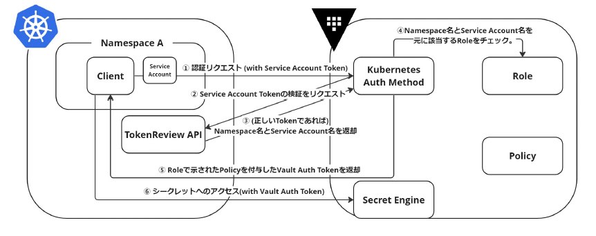
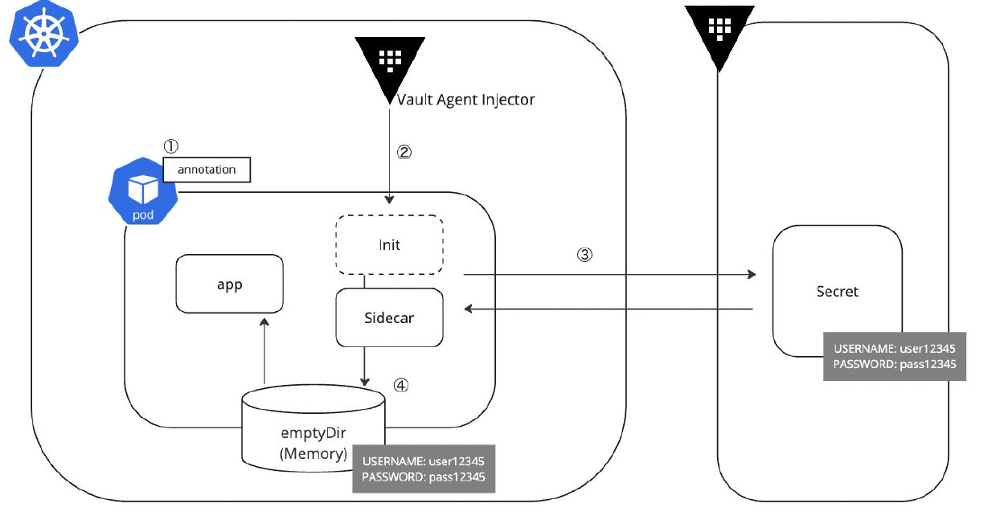
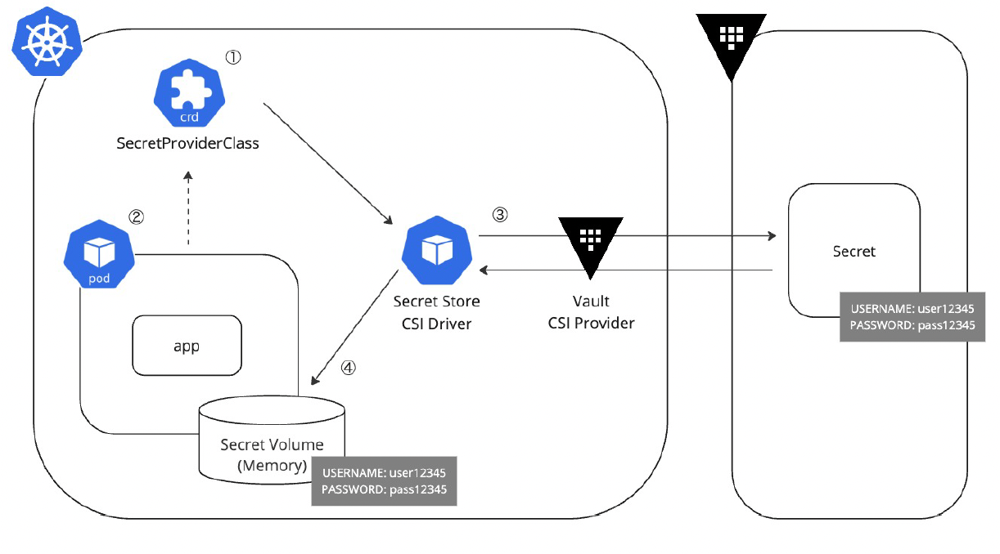
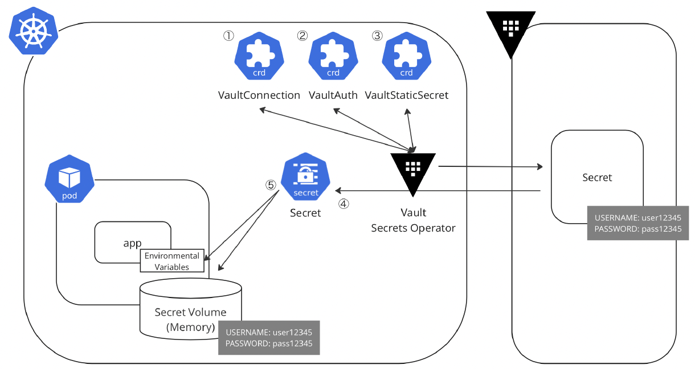
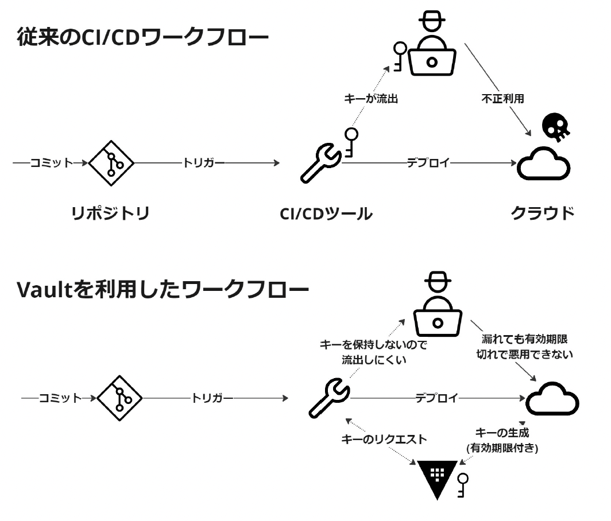

# vault

- よくある機密情報は以下
  - クラウドサービスのアクセスキー、シークレットキー
  - データベースのユーザー名、パスワード
  - SSH で利用する秘密鍵
  - TLS で利用する証明書と秘密鍵
  - API トークン
- secret を安全に管理するには?
  - Sealed Secrets
    - kubeseal コマンドを使って暗号化された secret を SealedSecrets として生成。kubernetes クラスタ側で secret を必要とする時は、Sealed Secrets Controller が秘密鍵を利用して復号してくれるため、Git にコミットしても安全性が保たれる
  - HashiCorp Vault
    - 秘密情報を集中管理
    - 秘密情報を暗号化して保存
    - 秘密情報へのアクセス制御(認証認可)
    - 秘密情報のローテーション
    - 人がアクセスする場合は GUI や CLI でアクセス可能
    - CI/CD やアプリケーションからアクセスする場合 CLI や API を使うことが多い
    - OIDC を利用した外部 IdP との連携、GitHub ユーザーを使った認証、LADP、RADIUS との連携が提供されている
    - アプリケーション向けでは、クラウドプロバイダーとの連携や Vault 独自の AppRole、TLS クライアント証明書など提供されている
    - EC2 や ECS、Lambda のような環境からもアクセス可能

## Vault のインストール

```bash
$ helm repo add hashicorp https://helm.releases.hashicorp.com
$ helm repo update
$ helm search repo hashicorp/vault
$ helm install vault hashicorp/vault --set "csi.enable=true" -n vault --create-namespace
$ kubectl get pod -n vault
```

## Vault の初期化

- vault はインストール直後は Sealed と呼ばれる状態になっており使用できない。使用できる状態にするためには初期化および Unseal する必要がある
  - ５つの Unseal Key と Root Key が生成される。Vault 独自の秘密情報のため厳重に管理する
- Unseal は初期化時に払い出された Unseal Key を Vault に渡すことで、Vault がデータにアクセスできるようにするための処理
  - Vault のデータは Encryption Key により暗号化されており、Encryption Key は Root Key により暗号化されている
  - Root Key は Shamir’s Secret Sharing と呼ばれる仕組みで分散管理された Unseal Key により暗号化されており特定数(デフォルト 3 つ)の Unseal Key を用いてることでデコードできる
- この Unseal 作業は Vault を再起動するたびに必要となるが、外部外部の仕組みと組み合わせて [Auto Unseal](https://developer.hashicorp.com/vault/tutorials/auto-unseal) という方法もある

```bash
$ kubectl exec -it vault-0 -n vault -- vault operator init
$ kubectl exec -it vault-0 -n vault -- vault operator unseal # unseal Keyの登録1回目
$ kubectl exec -it vault-0 -n vault -- vault operator unseal # unseal Keyの登録2回目
$ kubectl exec -it vault-0 -n vault -- vault operator unseal # unseal Keyの登録3回目
$ kubectl get pod -n vault # これでVaultが利用できるようになる
```

## Vault への秘密情報登録

- 以下は検証のため Root Token を利用しているが、Root Token は初期セットアップが終わったら無効化しておくことが推奨されている
- vault の[様々なコマンド](https://developer.hashicorp.com/vault/docs/commands)

```bash
$ kubectl exec -it vault-0 -n vault -- /bin/sh
$ vault login
Token (will be hidden):<初期化時に払い出されたRoot Keyを入力>
$ vault secrets enable -path=secret kv-v2 # secrets Engineを有効化にする(様々なものが用意されているがここではKey-Vault型のsecrets Engineをsecretという名で有効化)
$ vault kv put secret/app/config USERNAME="user12345" PASSWORD="pass12345" # secret/app/configというパスの配下に2つの情報登録
$ vault kv get secret/app/config # 登録した情報の参照
```

## Vault へのリモートアクセス

- 上記は Vault が起動している Pod に exec して Vault の操作をしているが Vault のエンドポイントを外部公開していれば別途 vault コマンドをインストールした端末からリモートアクセス可能

```bash
$ kubectl get service -n vault
$ kubectl port-forward service/vault -n vault 8200:8200
$ export VAULT_ADDR=http://127.0.0.1:8200/
$ vault login
```

## Kubernetes と Vault の連携

### Kubernete Auth Method

- Kubernetes から Vault への認証認可は Kubernetes Auth Method を通して実行できる

```bash
$ kubectl exec -it vault-0 -n vault -- /bin/sh
$ vault login
$ vault auth enable kubernetes # kubernetes Authの有効化
$ vault auth list # 有効化した認証の確認
$ vault write auth/kubernetes/config kubernetes_host=https://$KUBERNETES_SERVICE_HOST:$KUBERNETES_SERVICE_PORT # vaultへのアクセスを可能とするkubernetes情報を登録
$ vault read auth/kubernetes/config # 登録したkubernetesの確認
```

### kubernetes auth method の仕組み

- 認証:Kubernetes 上に作成した ServiceAccount
- 認可:Vault 上に作成した Policy および Role
- ServiceAccount:Kubernetes 上で管理されるアカウント
- ServiceAccountToken:ServiceAccount に紐づけられた Token。Kubernetes から Vault への認証リクエストはそのトークンが付与される
- Policy:指定したパスにある秘密情報に対して、特定の権限を定義するもの
- Role:特定の Namespace、ServiceAccount、そして Policy を指定して紐付けを行うもの



```bash
$ kubectl create sa app -n default # ServiceAccount作成
$ vault policy write app-secret - <<EOF # 秘密情報に対する権限を定義するPolicyの作成。pathには対象の秘密情報のパスを、capabilitiesには行使できる権限を指定
path "secret/data/app/confg" {
    capabilities = ["read"]
}
EOF
$ vault policy list # Policyの確認
$ vault policy read app-secret # Policyの確認
# 作成したPolicyとKubernetes上のnamespaceとserviceaccountに紐付け紐付けするRoleを作成24hはkubernetes auth methodに認証後に発行されるVaultのAuth Tokenの有効期限
$ vault write auth/kubernetes/role/app bound_service_account_names=app bound_service_account_namespaces=default policies=app-secret ttl=24h
$ vault list auth/kubernetes/role
$ vault read auth/kubernetes/role/app
```

## Vault を用いた kubernetes の sercret の管理

- vault 上に作成した機密情報を kubernetes リソースと連携する方法は複数存在する
  - vault Agent
    - Pod デプロイ時に Vault Agent を Init Container および Sidecar Container として挿入し、秘密情報をファイルとして共有 Volume(メモリ)に配置する方法
      - vault Agent init container
      - vault Agent sidecar
  - vault csi provider
    - secret store CSI Driver と Vault CSI Provider が連携して Vault から秘密情報を取得し、Pod に Volume(メモリ)としてマウントする方式
  - vault secrets operator
    - vault secret operator が Vault から秘密情報を取得し Secret を作成する方式
  - またこのほかの Kubernetes に Pod としてデプロイしたアプリケーションから直接 Vault API を実行実行し秘密情報を取得する方式も存在する

### Vault Agent

- annotation が付与された Pod が Kubernetes にデプロイされると Vault Agent Injector が該当 Pod に Vault Agent を Init Container および Sidecar Container として挿入する
- ここで各コンテナは Kubernetes の Mutation Webhook という仕組みを用いて挿入される
- 挿入された Vault Agent は Vault から秘密情報を取得し、Pod 内の各コンテナが参照可能な共有メモリ上に秘密情報が記載されたファイルを作成する
  

```bash
$ kubectl apply -f manifest/vaultagent/app-vault-agent-simple.yaml
$ kubectl get po -l app=app-vault-agent-simple -w
$ kubectl exec -it app-vault-agent-simple -c app -- /bin/bash
$ cat /vault/secrets/app-config.txt # 秘密情報が取得できるか確認
```

- アプリケーションが秘密情報を利用する場合は/vault/secrets/app-config.txt から必要情報を読み取れば良いがこれでは少し扱いづらいため Temlate という機能がある
- Template
  - Vault から取得した秘密情報を任意のフォーマットで取り扱うことができる
  - Template を利用しフォーマットを指定した秘密情報の取得
    - metadata.annotations に vault.hashicorp.com/agent-inject-template-<ファイル名>を指定するフィールドを追加したマニフェストを用意する

```bash
$ kubectl apply -f manifest/vaultagent/app-vault-agent-template.yaml
$ kubectl get po -l app=app-vault-agent-template
$ kubectl exec -it app-vault-agent-template -c app -- /bin/bash
$ cat /vault/secrets/app-config.txt
```

- 環境変数への秘密情報設定
  - vault Agent を用いる方式では Pod 内に直接秘密情報を含むファイルが作成されるため Kubernetes の Sercret が作成されることはない
  - vault から取得した秘密情報をコンテナの環境変数に設定したい場合対応できていない
  - 今回の場合 Vault Agent の Template 機能を用いて用いて秘密情報を環境変数に設定できる形式に加工し、コンテナ起動時にそれらの値を環境変数に設定するといった工夫が必要
  - app-vault-agent-env.yaml はコンテナ起動時のコマンドで Vault Agent が生成したファイルに記載された値を source コマンドで環境変数に設定し、その値を echo で出力している

```bash
$ kubectl apply -f manifest/vaultagent/app-vault-agent-env.yaml
$ kubectl get po -l app=app-vault-agent-env
$ kubectl logs app-vault-agent-env -c app
```

- Init Container のみを用いた秘密情報の取得

  - metadata.annotations では Vault Agent の振る舞いを変更することができる

        - vault.hashicorp.com/agent-pre-populate-only というフィールドを trueに設定することで、Pod デプロイ時に Init Container で Vault から秘密情報を取得した後、SidecarContainer を起動しないという動きに変更できる
        - Sidecar Container を利用しない場合、Pod デプロイ後に Vault 側で秘密情報の更新が発生してもその値を Pod に反映させることはできないが、Sidecar Container のためのリソースが消費されなくなるためユースケースによってはこちらの方が適している場合もある

  - Init Containder による Pod デプロイ時の秘密情報取得のみ行われ、Sidecar は起動しないようになる

```bash
$ kubectl apply -f manifest/vaultagent/app-vault-agent-init-only.yaml
$ kubectl get po -l app=app-vault-agent-init-only -w
$ kubectl exec -it app-vault-agent-init-only -c app -- /bin/bash
```

### Vault CSI Provider

- kubernetes-sigs では Container Storage Interface(CSI)と呼ばれる仕様に基づき秘密情報を Volume として Pod にマウントするための仕組みである Kubernetes Secrets Store CSI Driver が開発された
- この仕組みと Vault インストール時に併せてインストールした Vault CSI Provider を利用することで、Vault に登録された秘密情報を Pod に Volume としてマウントできる

  1. Vault への接続情報や使用する秘密情報の Key を定義した SecretProviderClass を作成
  2. SecretProviderClass を指定して Pod をデプロイ
  3. Kubernetes Secrets Store CSI Driver が SecretProviderClass の情報を元に Vault CSI Provider 経由で Vault から秘密情報を取得
  4. 秘密情報を Pod の Volume としてマウント
     

- Kubernetes Secrets Store CSI Driver のインストール

```bash
$ helm repo add secrets-store-csi-driver https://kubernetes-sigs.github.io/secrets-store-csi-driver/charts
$ helm repo update
$ helm install csi secrets-store-csi-driver/secrets-store-csi-driver \
--set syncSecret.enabled=true --create-namespace -n secrets-store-csi-driver
$ kubectl get po -n secrets-store-csi-driver
```

- Vault CSI Provider による Kubernetes からの秘密情報取得
  - Kubernetes Secrets Store CSI Driver のインストールが完了したら Secret-ProviderClass を定義したマニフェストを用意する。
  - Vault へのアクセス情報に加え、使用する秘密情報の登録先、秘密情報を Pod にマウントする際のファイル名を指定
  - SecretProviderClass が作成されたら、SecretProviderClass を指定した形で Pod のマニフェストを用意

```bash
$ kubectl apply -f manifest/vaultagent/app-vault-spc.yaml
$ kubectl get SecretProviderClass
$ kubectl apply -f manifest/vaultagent/app-vault-csi.yaml
$ kubectl get po -l app=app-vault-csi
$ kubectl exec -it app-vault-csi -- /bin/bash
$ ls /mnt/secrets-store/
$ cat /mnt/secrets-store/username-from-csi
$ cat /mnt/secrets-store/password-from-csi
```

- Kubernetes Secret の作成
  - Kubernetes Secrets Store CSI Driverd では、Pod にマウントした秘密情報から Kubernetes の Secret を作成する機能が提供されている
  - SecretProviderClass を app-vault-spc-with-secret.yaml のような形で定義することで、Pod への Volume マウントに併せて Kubernetes 上に Secret を作成することが可能
  - SecretProviderClass を指定した形で Pod のマニフェスト(app-vault-csi-with-secret.yaml)を用意。ここでは Volume マウント時に自動生成される Secret に含まれる値をコンテナの環境変数として設定
  - Pod のデプロイが完了すると Secret が自動的に作成され、Vault に登録した秘密情報が反映される

```bash
$ kubectl apply -f manifest/vaultagent/app-vault-spc-with-secret.yaml
$ kubectl apply -f manifest/vaultagent/app-vault-csi-with-secret.yaml
$ kubectl get po -l app=app-vault-csi-with-secret.yaml
$ kubectl get secret
$ kubectl get secret app-secret-from-csi -o json="{.data}"
$ echo dXNlcjEyMzQ1 | base64 -d
$ echo cGFzczEyMzQ1 | base64 -d
$ kubectl exec -it app-vault-csi-with-secret -- /bin/bash
$ env | grep USERNAME # コンテナの環境変数を確認
```

## Vault Secrets Operator

- 2023 年 3 月 29 日に公式ブログにて投稿され注目を浴びている

### Vault Secrets Operator の登場以前

- Vault Agent と Vault CSI Provider は取得した秘密情報を適切に環境変数に登録し最新の状態に維持することが難しかった
  - Vault Agent は秘密情報を含むファイルのフォーマットを指定する項目において export をするように記述し、source コマンドによって環境変数に適用するといった方法
    - この方法はいくつか問題、以下の考慮点が発生する
      - 環境変数を設定するために何かしらの目的を持ったコンテナの起動時のコマンドを変更することになる
      - コンテナ内にいつも source コマンド等の環境変数を設定するためのコマンドが存在するとも限らない
  - Vault CSI Provider は、.spec.parameters.objects[*].objectName に記述した username-from-csi を Pod 側の secretKeyRef において指定することで環境変数に取り込むことができた
    - この方法の問題、以下の考慮点が発生する
      - Vault CSI Provider が Vault 側での秘密情報の更新を認識および反映してくれない
      - つまり Vault でどれだけ更新しても、新しいアプリケーション上の秘密情報は古いままの状態になってしまう
  - 上記の問題点を補う 1 つとして [External Secrets](https://github.com/external-secrets/external-secrets/) がある。
    - Vault に格納された秘密情報を Kubernetes の Secret リソースとして登録することができる
  - Vault Secrets Operator が External Secrets と同じような機能を持つ Operator

### Vault Secrets Operator

- Key-Vaule の秘密情報を Kubernetes 上に Secret リソースとして登録するのに 3 つのカスタムリソースを用いる
  
  1. 接続先の Vault 情報を定義するための VaultConnection を作成
  2. Vault に接続する際に用いる Service Account と Vault 上にある Role を指定する VaultAuth を作成
  3. 取得したい秘密情報を指定する VaultStaticSecret を作成
  4. VaultStaticSecret の適用をトリガーに、Vault Secrets Operator が Vault から秘密情報を取得し、Secret リソースを作成
  5. Pod に Secret を環境変数、もしくは Volume としてアタッチ

### 新規 Secret の作成

```bash
$ helm repo update
$ helm search repo vault-secrets-operator
$ helm install --version 0.4.3 --create-namespace --namespace vault vault-secrets-operator hashicorp/vault-secrets-operator
$ kubectl get pods -n vault
$ kubectl api-resources | grep vault
```

1. [vaultConnection マニフェスト](https://developer.hashicorp.com/vault/docs/platform/k8s/vso#vaultconnection-custom-resource)を用意(app-vault-connection.yaml)

- 同じ Kubernetes 上に作成した Vault を参照するため、vault という Service をエンドポイントに指定

```bash
$ kubectl apply -f manifest/vaultsecretsoperator/app-vault-connection.yaml
$ kubectl get vaultconnection -n default
```

2. [VaultAuth マニフェスト](https://developer.hashicorp.com/vault/docs/platform/k8s/vso#vaultauth-custom-resource)を用意(app-vault-auth.yaml)

```bash
$ kubectl apply -f manifest/vaultsecretsoperator/app-vault-auth.yaml
$ kubectl get vaultauth -n default
```

3. [VaultStaticSecret マニフェスト](https://developer.hashicorp.com/vault/docs/platform/k8s/vso#vaultstaticsecret-custom-resource)を用意(app-vault-static-secret.yaml)

```bash
$ kubectl apply -f manifest/vaultsecretsoperator/app-vault-static-secret.yaml
$ kubectl get vaultstaticsecret -n default
$ kubectl get secret
$ kubectl get secret app-secret-from-vso -o yaml
$ kubectl get secret app-secret-from-vso -n default -o jsonpath='{.data._raw}' | base64 -d
$ kubectl get secret app-secret-from-vso -n default -o jsonpath='{.data.USERNAME}' | base64 -d
$ kubectl get secret app-secret-from-vso -n default -o jsonpath='{.data.PASSWORD}' | base64 -d
```

### Secret の更新

- 上記で取得した Secret の情報を Vault 側で更新し、新しい値が Secret に反映されているか確認

```bash
$ vault kv put secret/app/config USERNAME="USER12345" PASSWORD="PASS12345"
$ kubectl get secret app-secret-from-vso -n default -o jsonpath='{.data.USERNAME}' | base64 -d
$ kubectl get secret app-secret-from-vso -n default -o jsonpath='{.data.PASSWORD}' | base64 -d
```

- Secret の更新が動的に実行されましたが、注意しなければならないのが、Secret を利用している Pod 上の秘密情報の更新。
- Secret を Volume として Pod にアタッチしている場合、Secret の更新を認識して動的に Pod 内の秘密情報の更新をかけるが、環境変数として取り込んでいる場合は更新がかからない
- この課題を対処するために VaultStaticSecret のマニフェストには rolloutRestartTargets パラメータが用意されている
  - これは vault 上の秘密情報の更新を認識した際に、指定したリソースのロールアウトを実行してくれる
  - 現状対応しているリソースは、Deployment, DaemonSet,StatefulSet の 3 つ

```bash
$ kubectl apply -f manifest/vaultsecretsoperator/app-vault-static-secret-with-rollout.yaml
$ kubectl apply -f manifest/vaultsecretsoperator/app-vault-vso.yaml
$ kubectl get pods -n default
$ kubectl exec -it app-vault-vso-bbf6697cd-hnvts -n default -- env | grep -e USERNAME -e PASSWORD # 環境変数の確認
$ vault kv put secret/app/config USERNAME="USER12345-vso" PASSWORD="PASS12345-vso" # Vault 上の秘密情報をアップデート
$ kubectl get pods -n default # 秘密情報の更新に伴って、自動で再作成が走る
$ kubectl exec -it app-vault-vso-5fffd854dd-hpjfk -n default -- env |grep -e USERNAME -e PASSWORD # pod内の環境変数確認
```

## Dynamic Secret

- Secret は保存するから流出する可能性がある。。ならば、保存せず必要に応じて生成するようにすれば、流出する可能性を下げられるという考え方
- vault を積極的に利用していく理由の 1 つ

### データベースのユーザー名とパスワードを動的に生成する

- 以下の DB に対応している
  - MySQL / MariaDB
  - PostgresSQL
  - Microsoft SQL Server
  - Oracle
  - MongoDB
  - IBM Db2
  - HANA DB
  - Redis
  - Cassandra
  - Couchbase
  - ElasticSearch
  - InfluxDB
  - Redshift
  - Snowflake

```bash
$ kubectl apply -f manifest/dynamicsecret/mysql.yaml
$ kubectl exec -it $(kubectl get pods --selector "app=mysql" -o jsonpath="{.items[0].metadata.name}") -c mysql -- bash -c 'mysql -u root -p'
Enter password: #rootpassと入力
mysql> create database workshop;
mysql> use workshop;
mysql> create table books (id int, name varchar(50), number varchar(50));
mysql> insert into books values (1, "Gijutsu Shoten", "2023/05");
mysql> select * from books;
mysql> exit;
# Secret Engineの設定
$ kubectl exec -n vault -it vault-0 -- /bin/sh
$ vault login <Root Token>
$ vault secrets enable database
$ vault write database/config/workshop-db \
plugin_name=mysql-database-plugin \
connection_url="{{username}}:{{password}}@tcp(mysql.default.svc.cluster.local:3306)/" \
allowed_roles="workshop-role" \
username="root" \
password="rootpass"
# roleの設定
$ vault write database/roles/workshop-role \
db_name=workshop-db \
creation_statements="CREATE USER '{{name}}'@'%' IDENTIFIED BY '{{password}}';GRANT SELECT ON *.* TO '{{name}}'@'%';" \
default_ttl="1h" \
max_ttl="24h"
# 動的ユーザーの作成
$ vault read database/creds/workshop-role
# mysqlアクセス確認
$ kubectl exec -it $(kubectl get pods --selector "app=mysql" -o jsonpath="{.items[0].metadata.name}") -c mysql -- bash -c 'mysql -u <生成されたユーザー名> -p workshop'
Enter password: #生成されたパスワードを入力
mysql> SELECT * FROM books;
# 生存期間の延長(生成ユーザーの有効期限を伸ばしたい場合) 延長可能な時間はユーザーが生成された時間からmax_ttl で設定した時間まで
$ vault lease renew -increment=23h database/creds/workshop-role/1Hb47bl9r7xupCCsnE2ECQdQ
# 作成したユーザーの削除(有効期限を待たずしてユーザーを削除したい場合)
$ vault lease revoke database/creds/workshop-role/1Hb47bl9r7xupCCsnE2ECQdQ
```

### Vault Agent Injector からの利用

- 動的なユーザー作成と利用を Kubernetes から行う

```bash
# policyの作成とroleへの紐付け
$ vault policy write db-app - <<EOF
path "database/creds/workshop-role" {
capabilities = ["read"]
}
EOF
$ vault write auth/kubernetes/role/app \
bound_service_account_names=app \
bound_service_account_namespaces=default \
policies=app-secret,db-app \
ttl=24h

$ kubectl apply -f manifest/dynamicsecret/pod.yaml
$ kubectl get pods
$ kubectl logs app-vault-agent-dynamic # usernameとpasswordが表示されていることを確認
```

- このように、データベースにユーザーを作成せずとも、Vault Agent を介して Pod が起動するタイミングでユーザーを作成することができる
- Pod ごとにユニークなユーザーを作成でき、TTL に応じてユーザーの更新が行われる。Pod を削除後は自動的にユーザーも削除されるため、ユーザーの管理が煩雑になることはない。

### Vault Secrets Operator からの利用

- これで一般的に利用される Secret リソースを活用しつつ、Vault による動的なユーザーの作成が可能になる

```bash
$ kubectl apply -f manifest/dynamicsecret/vaultdynamicsecret.yaml
$ kubectl get secret mysql-secret-from-vso -o yaml
```

### rotate-root で root 権限を安全にする

- Vault が自動的に root のパスワードを変更してくれる
- 変更した root パスワードは Vault の管理者であっても見ることができない

```bash
# rotate-root の実行
$ vault write --force /database/rotate-root/workshop-db
```

- root 権限で作業できなくなるため、Vault は新たな Role を作成して、root 権限を持ったユーザーを動的に作成するようにする

```bash
# root-roleの作成
$ vault write database/roles/root-role \
db_name=workshop-db \
creation_statements="CREATE USER '{{name}}'@'%' IDENTIFIED BY '{{password}}';GRANT ALL PRI→
VILEGES ON *.* TO '{{name}}'@'%';" \
default_ttl="1h" \
max_ttl="24h"

# configに保存
$ vault write database/config/workshop-db \
plugin_name=mysql-database-plugin \
connection_url="{{username}}:{{password}}@tcp(mysql.default.svc.cluster.local:3306)/" \
allowed_roles=workshop-role,root-role

# root権限を持ったユーザーの動的な作成
$ vault read database/creds/root-role
```

- これで root 権限を持ったユーザーも必要な時に作成できるようになる
- 固定パスワードの root ユーザーを使うのと比べ、1 時間だけ有効なユーザーを作成できるため、万が一の漏洩の際にも安全性を保つことができる
- Vault のログを確認することで、いつ誰がユーザーを作成したのかを追うこともできるため、監査の観点からも有効

### その他 AWS や GCP,Azure でも使える

- またこの Dynamic Secret の仕組みを活用すると CI/CD ツールからデプロイを行う際に Just in time でユーザーを作成し、使い終わったら消すといったことが可能
- CI/CD ツールにクラウドサービスの認証情報を保存しておく必要がなくなるため、ツール側で漏洩事故が起こったとしても慌てる必要がなくなる
  

### kubernetes

- Kubernetes Secret Engine
  - 「Vault から Kubernetes にアクセスし、Kubernetes の中の Service Account を動的に生成する」
  - Service Account も、一般的に一度作ったら作りっぱなしになりやすいリソース
  - Service Account に対して権限を付与していく RoleBinding、ClusterRoleBinding を設定していくのは地味に面倒な作業
  - 不要になった ServiceAccount を細かく削除しているという人も、意外と少ない
  - 作りっぱなしになっている Service Account が、セキュリティの問題を起こしてしまう可能性はゼロではない
  - Kubernetes Secret Engine なら。Vault を経由して、必要なときにだけ Service Account が存在するようにすれば、リスクを軽減できる

### SSH

- SSH Secret Engine
  - これを利用すると、ワンタイムパスワード (OTP) や、SSH 鍵署名などの仕組みを使って、短期だけ有効な権限で SSH 接続を行うことができる

### LDAP

- LDAP Secret Engine
  - LDAP サーバーに対して動的なユーザーとパスワードを生成することができる

### PKI

- PKI Secret Engine
  - Vault をルート認証局、もしくは中間認証局として利用することができる
  - 社内で独自の公開鍵認証基盤を運用している場合は、Vault を中間認証局として利用することで、Vault CLI や GUI、API を介した証明書の発行を行うことができる
  - Kubernetes から利用する場合、cert-manager が Vault に対応しているため、Certificate リソースを使って簡単に証明書を発行することができる

### GitHub / GitLab

- Vault Plugin Secrets GitHub や Vault Plugin for Gitlab Project Access Token
  - GitHub や GitLab の Access Token を Vault から動的に作成することが可能
  - 現時点では Vault の公式機能として含まれていないため、自身で Plugin の導入を行う必要があり
  - GitHub や GitLab の Access Token を利用してリポジトリの Clone や CI/CD パイプラインの操作を自動化するというユースケースは非常に多く見られる
  - その際に利用する Access Token は、一度作ったらずっと使い回すことが多い
  - GitHubAPPS とどう違う？
